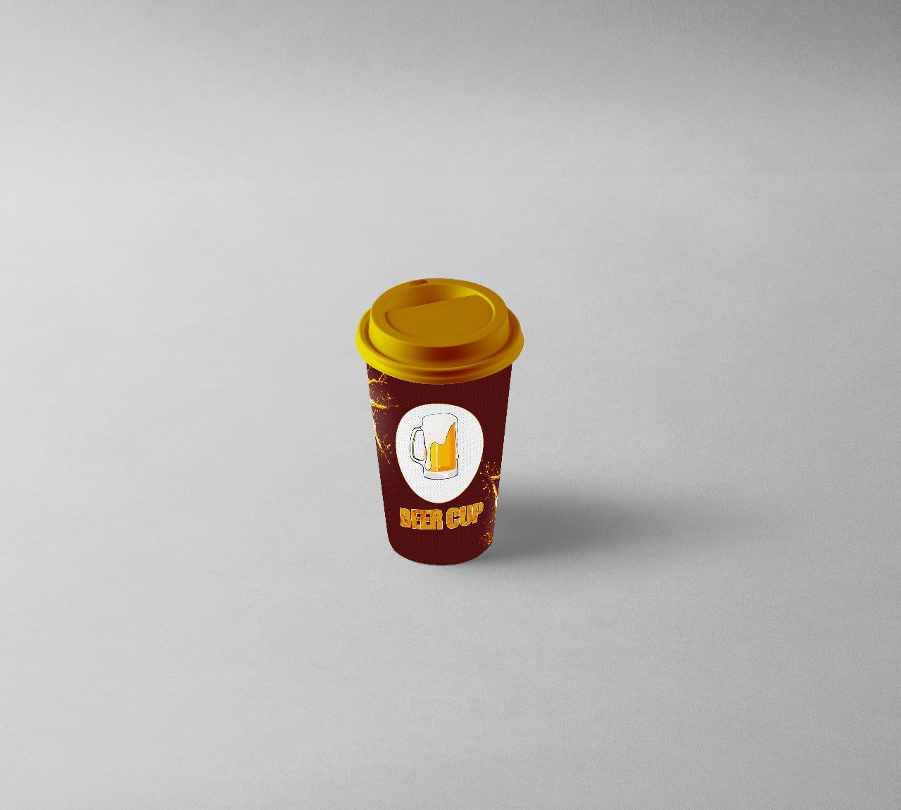

## Beer Cup - Main Page

 >> O modelo de embalagem Long Neck surgiu para concorrer com as latas de alumínio e representam um montante de 90% de material não reciclável. Assim, o custo da reciclagem das embalagens de Long Neck acaba sendo mais caro do que o uso de matéria prima nova. O que significa que fazer o vidro do zero é economicamente mais vantajoso do que seu reaproveitamento. Esse impacto negativo das garrafas long necks no ambiente tem gerado um movimento no âmbito de leis que pode ser um fator preocupante para o mercado cervejeiro nos próximos anos. Há inclusive, projetos de lei  que visam proibir a distribuição ou obrigar o recolhimento dessas embalagens.
 #
 
##### Pensando nisso, o Beer Cup visa ser uma alternativa de embalagem mais barata e biodegradável em material misto de plástico e papel feito com insumos de subprodutos da própria cerveja. Feito de PFE material derivado de matéria-prima de biomassa, o Beer Cup proporciona um perfeito isolante térmico para a cerveja mantendo temperatura e sabor.  

>> Assim, a substituição gradual das garrafas long necks por uma solução mais barata e que esteja consoante com boas práticas ambientais reafirma o compromisso da ambev com a redução dos impactos ambientais, além de representar uma economia relevante de custos. 
O Beer  cup é uma solução simples para a responsabilidade pós consumo e representa um enorme ganho ambiental em relação às atuais garrafas de vidro que tem um período de decomposição na natureza indefinido. 

